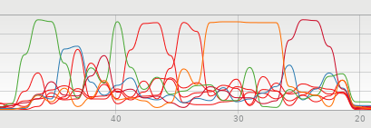
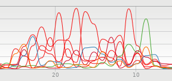

# Benchmarking Popular NodeJS Logging Libraries

Loggly ran a series of performance tests on some of the most popular node js
libraries. These tests are designed to show how quickly each library processed
logging and  impact on the overall application.

## The Contenders

For this test, we investigated some of the most commonly used Nodejs logging
libraries:

* `winston-syslog` for syslog logging with winston
* `node-bunyan-syslog` for syslog logging with bunyan

We sent log info to a local rsyslog server over both TCP and UDP.

## Setup and Configuration

Our goal was to measure the amount of time needed to log. Each library is on its
default configuration and its the same across all libraries and tests

## The Test Project

Our test application logged a total of 1,000,000 log events. The tests were done
three times and results were averaged. While logging for a typical application
you may not put it through similar load but it helps in figuring efficiency of
logging libraries. In most situations you will not see dropped events as they
are usually spread out.

The source code for the project is on GitHub at
[https://github.com/codejamninja/node-log-benchmarks](https://github.com/codejamninja/node-log-benchmarks).

## Hardware and Software

| Name             | Spec                                              |
|------------------|---------------------------------------------------|
| Processors       | Intel Core i7-7700 @ 2.80GHz (4 cores, 8 threads) |
| Memory           | 32GB Ram                                          |
| Operating System | 64-bit Ubuntu 18.04.2 LTS Server                  |
| NodeJS           | 8.15.1 LTS                                        |

## Test Results

For all tests, the results are measured in milliseconds.

### Console

For the first set of test results, we benchmarked the performance of the
libraries when logging to the console.

#### log4js

_1cpu_


_8cpus_



|             |     1 CPU |    8 CPUs |
|-------------|-----------|-----------|
| Test 1      |     67887 |     23936 |
| Test 2      |     64484 |     23741 |
| Test 3      |     68626 |     25478 |
| **Average** | **66999** | **24385** |

From these results we can see additional CPUs had a significant effect on the
time.

#### winston

_1cpu_


_8cpus_


|             |     1 CPU |    8 CPUs |
|-------------|-----------|-----------|
| Test 1      |     32128 |     11010 |
| Test 2      |     31186 |     10591 |
| Test 3      |     29844 |     10666 |
| **Average** | **31053** | **10756** |

Again, additional CPUs had an large effect on the time.

#### bunyan

_1cpu_


_8cpus_



|             |     1 CPU |    8 CPUs |
|-------------|-----------|-----------|
| Test 1      |     29144 |     14998 |
| Test 2      |     28728 |     15324 |
| Test 3      |     31656 |     14863 |
| **Average** | **29843** | **15062** |

While additional CPUs had an effect on the time with bunyan, it had less of an
effect than the previous logging libraries.

#### Console Summary

|         | 1 CPU | 8 CPUs |
|---------|-------|--------|
| log4js  | 66999 |  24385 |
| winston | 31053 |  10756 |
| bunyan  | 29843 |  15062 |

Looking at the results, winston is the clear winner for speed in multithreaded
systems, however bunyan performed slightly better in a single threaded
system.

### Filesystem

For the seconds set of test results, we benchmarked the performance of the
libraries when writing the logs to the filesystem.

Notice that each test result contains two times, _unblocked_  and _done_. This
is because NodeJS filesystem writes are nonblocking (asyncronous). The
_unblocked_ time lets us know when the code used to schedule the filesystem
writes is finished and the system can continue executing additional business
logic. However, the filesystem will still be asyncronously writing in the
background. So, the _done_ time lets us know how long it took to actually write
the logs to the filesystem.

#### log4js

_1cpu_


_8cpus_


|             |       1 CPU |    1 CPU |      8 CPUs |    8 CPUs |
|-------------|-------------|-----------|-------------|-----------|
|             | _unblocked_ |    _done_ | _unblocked_ |    _done_ |
| Test 1      |       15983 |     32228 |       15241 |     31529 |
| Test 2      |       16939 |     33576 |       15450 |     31332 |
| Test 3      |       14749 |     31023 |       15055 |     31890 |
| **Average** |   **15890** | **32276** |   **15249** | **31584** |

It's interesting that additional CPUs had little effect on the time.

#### winston

_1cpu_


_8cpus_


|             |       1 CPU |   1 CPU |      8 CPUs |   8 CPUs |
|-------------|-------------|----------|-------------|----------|
|             | _unblocked_ |   _done_ | _unblocked_ |   _done_ |
| Test 1      |         691 |     8891 |         431 |     7351 |
| Test 2      |         722 |     9169 |         497 |     7360 |
| Test 3      |         760 |     8885 |         497 |     7602 |
| **Average** |     **724** | **8982** |     **475** | **7438** |

Additional CPUs seemed to have a small effect on the time.

#### bunyan

_1cpu_


_8cpus_


|             |       1 CPU |   1 CPU |      8 CPUs |   8 CPUs |
|-------------|-------------|----------|-------------|----------|
|             | _unblocked_ |   _done_ | _unblocked_ |   _done_ |
| Test 1      |        4212 |     4476 |        3815 |     4059 |
| Test 2      |        4264 |     4507 |        4113 |     4358 |
| Test 3      |        4076 |     4351 |        3935 |     4175 |
| **Average** |    **4184** | **4445** |    **3954** | **4197** |

Surprisingly again, additional CPUs had little effect on the results.

#### Filesystem Summary

|         |       1 CPU | 1 CPU |      8 CPUs | 8 CPUs |
|---------|-------------|--------|-------------|--------|
|         | _unblocked_ | _done_ | _unblocked_ | _done_ |
| log4js  |       15890 |  32276 |       15249 |  31584 |
| winston |         724 |   8982 |         475 |   7438 |
| bunyan  |        4184 |   4445 |        3954 |   4197 |

log4js seemed to have the worst results writing to a filesystem, sometimes
taking over 5 times the amount of time to write to the filesystem. Winston
unblocked the event loop the fastest, but bunyan finished writing to the
filesystem the fastest.

### Syslog UDP

For the seconds set of test results, we benchmarked the performance of the
libraries when sending the logs to syslog.

Again, notice that each test result contains two times, _unblocked_  and _done_.
This is because the libraries sometimes asyncronously send the logs to syslog.

#### log4js

_1cpu_


_8cpus_


|             |       1 CPU |     1 CPU |       1 CPU |      8 CPUs |    8 CPUs |      8 CPUs |
|-------------|-------------|-----------|-------------|-------------|-----------|-------------|
|             | _unblocked_ |    _done_ | _drop rate_ | _unblocked_ |    _done_ | _drop rate_ |
| Test 1      |        6117 |     60486 |       0.00% |        5912 |     11891 |       0.00% |
| Test 2      |        6303 |     58396 |       0.00% |        6101 |     12255 |       0.00% |
| Test 3      |        6214 |     59609 |       0.00% |        5635 |     11719 |       0.00% |
| **Average** |    **6211** | **59497** |   **0.00%** |    **5883** | **11955** |   **0.00%** |

#### winston

_1cpu_


_8cpus_


|             | 1 CPU       | 1 CPU  | 1 CPU       | 8 CPUs      | 8 CPUs | 8 CPUs      |
|-------------+-------------+--------+-------------+-------------+--------+-------------|
|             | _unblocked_ | _done_ | _drop rate_ | _unblocked_ | _done_ | _drop rate_ |
| Test 1      |             |        |             | 76702       | 142871 |             |
| Test 2      |             |        |             |             |        |             |
| Test 3      |             |        |             |             |        |             |
| **Average** | ****        | ****   | ****        | **76702**   | **142871**   | ****        |

Frustratingly, winston does a really poor job sending logs to syslog over UDP.
First of all, it's worth mentioning that when it did work it took well over a
minute to unblock the event loop, and took over two minutes to finish sending
the logs to syslog. However, most of the times I tested it, I ran out of memory
before I could finish.

```
#
# Fatal error in , line 0
# API fatal error handler returned after process out of memory
#
Illegal instruction (core dumped)
```

Most of the time the heap would run out of memory.

```
FATAL ERROR: CALL_AND_RETRY_LAST Allocation failed - JavaScript heap out of memory
```

This tells me that when using UDP, the library aggregates all the logs in the heap before
sending them to syslog, instead of immediately streaming the logs over to
syslog.

#### bunyan

_1cpu_


_8cpus_


|             |       1 CPU |      1 CPU |       1 CPU |      8 CPUs |    8 CPUs |      8 CPUs |
|-------------|-------------|------------|-------------|-------------|-----------|-------------|
|             | _unblocked_ |     _done_ | _drop rate_ | _unblocked_ |    _done_ | _drop rate_ |
| Test 1      |      102314 |     102325 |       0.00% |       12188 |     12216 |       0.30% |
| Test 2      |      106427 |     106466 |       0.00% |       11425 |     11436 |       0.37% |
| Test 3      |      104309 |     104320 |       0.00% |       12424 |     12436 |       0.38% |
| **Average** |  **104350** | **104370** |   **0.00%** |   **12012** | **12029** |   **0.35%** |

#### Filesystem Summary

|         |       1 CPU |  1 CPU |       1 CPU |      8 CPUs | 8 CPUs |      8 CPUs |
|---------+-------------+--------+-------------+-------------+--------+-------------|
|         | _unblocked_ | _done_ | _drop rate_ | _unblocked_ | _done_ | _drop rate_ |
| log4js  |        6211 |  59497 |       0.00% |        5883 |  11955 |       0.00% |
| winston |             |        |             |       76702 | 142871 |             |
| bunyan  |      104350 | 104370 |       0.00% |       12012 |  12029 |       0.35% |
